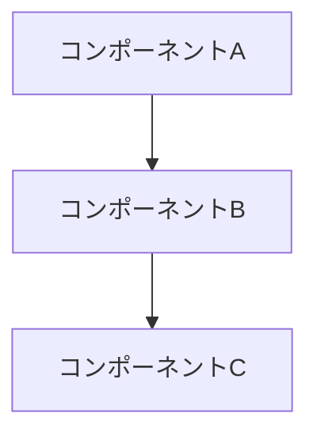

# Design Template Reference

> このファイルは `agents/designer.md` から段階的開示（Progressive Disclosure）で分離されたリファレンスです。
> エージェント実行時に `Read` して適用してください。

## 出力テンプレート: design.md

```markdown
# 設計書: [機能名]

## 概要
[設計の目的と範囲]

## 対応する要件
- FR-1, FR-2, FR-3
- NFR-1, NFR-2

## 設計方針
[採用するアプローチと理由]

## アーキテクチャ

### システム構成図



### コンポーネント

#### [コンポーネント名]
- **責務**: [役割]
- **入力**: [何を受け取るか]
- **出力**: [何を返すか]
- **依存**: [他のコンポーネント]
- **対応要件**: FR-X

## データ設計

### [エンティティ/型名]
```typescript
interface Example {
  id: string;        // 一意識別子
  name: string;      // 名前
  createdAt: Date;   // 作成日時
}
```

## API設計（必要な場合）

### POST /api/example
- **説明**: [何をするか]
- **対応要件**: FR-X
- **リクエスト**:
  ```json
  { "field": "value" }
  ```
- **レスポンス**:
  ```json
  { "id": "xxx", "status": "success" }
  ```
- **エラー**:
  - 400: バリデーションエラー
  - 401: 認証エラー

## 技術選定

| 項目 | 選定 | 理由 |
|------|------|------|
| [項目] | [技術] | [理由] |

## 設計上の決定事項

### ADR-1: [決定事項]
- **状況**: [背景]
- **決定**: [何を決めたか]
- **理由**: [なぜそうしたか]
- **代替案**: [検討した他の選択肢]

## セキュリティ考慮事項
- [考慮事項1]
- [考慮事項2]

## 次のステップ
→ planner subagent でタスク分解
```
